# QA Playwright Lab


Projeto de portfólio desenvolvido para praticar, organizar e documentar **testes automatizados end-to-end com Playwright e JavaScript**.

O projeto demonstra uma suíte de automação Web cobrindo fluxos funcionais do SauceDemo, com validações, evidências, execução via terminal, organização dos testes utilizando **Page Object Model**, integração contínua com **GitHub Actions** e **Azure Pipelines**, além de organização e rastreabilidade das atividades utilizando **Azure Boards**.

---

## Tecnologias utilizadas

- Playwright;
- JavaScript;
- Node.js;
- Playwright Test Runner;
- Page Object Model;
- GitHub Actions;
- Azure DevOps;
- Azure Pipelines;
- Azure Boards;
- CI/CD;
- SauceDemo;
- Git;
- GitHub;
- Markdown;
- Visual Studio Code.

---

## Sistema utilizado para teste

Aplicação: [SauceDemo](https://www.saucedemo.com/)

O SauceDemo é uma aplicação Web utilizada para estudos e práticas de QA, permitindo validar fluxos como autenticação, carrinho e checkout.

---

## Escopo da automação

A suíte automatizada cobre os seguintes fluxos:

- Login com usuário válido;
- Login com usuário inválido;
- Login com usuário bloqueado;
- Adição de produto ao carrinho;
- Validação de produto no carrinho;
- Checkout completo;
- Execução da suíte completa via terminal;
- Execução automatizada via GitHub Actions;
- Execução automatizada via Azure Pipelines;
- Publicação de relatório HTML como artifact;
- Organização e rastreabilidade de atividades com Azure Boards;
- Organização dos testes com Page Object Model.

---

## Estrutura do projeto

```text
qa-playwright-lab/
├── .github/
│   └── workflows/
│       └── playwright.yml
├── docs/
│   └── evidencias/
│       └── playwright/
│           ├── azure-devops/
│           │   ├── azure-devops-pipeline-yaml-integrado.png
│           │   ├── azure-devops-pipeline-sucesso.png
│           │   ├── azure-devops-playwright-6-testes-passando.png
│           │   ├── azure-devops-artifact-playwright-publicado.png
│           │   ├── azure-devops-artifact-playwright-disponivel.png
│           │   ├── azure-devops-relatorio-playwright-6-passed.png
│           │   ├── azure-devops-boards-issue-concluido.png
│           │   └── azure-devops-boards-rastreabilidade-issue-tasks.png
│           ├── login-valido-teste-passando.png
│           ├── login-valido-saucedemo.png
│           ├── login-invalido-teste-passando.png
│           ├── login-invalido-saucedemo.png
│           ├── login-usuario-bloqueado-teste-passando.png
│           ├── login-usuario-bloqueado-saucedemo.png
│           ├── produto-adicionado-carrinho-teste-passando.png
│           ├── produto-adicionado-carrinho-saucedemo.png
│           ├── validacao-carrinho-teste-passando.png
│           ├── validacao-carrinho-saucedemo.png
│           ├── checkout-completo-teste-passando.png
│           ├── checkout-completo-saucedemo.png
│           ├── suite-completa-playwright-passando.png
│           ├── suite-completa-playwright-pom-passando.png
│           └── github-actions-playwright-passando.png
├── pages/
│   ├── LoginPage.js
│   ├── InventoryPage.js
│   ├── CartPage.js
│   └── CheckoutPage.js
├── tests/
│   ├── saucedemo-login.spec.js
│   ├── saucedemo-cart.spec.js
│   └── saucedemo-checkout.spec.js
├── .gitignore
├── azure-pipelines.yml
├── package.json
├── package-lock.json
├── playwright.config.js
└── README.md
```

---

## Como executar o projeto

Instale as dependências:

```bash
npm install
```

Execute toda a suíte:

```bash
npx playwright test --headed
```

Execute apenas os testes de login:

```bash
npx playwright test tests/saucedemo-login.spec.js --headed
```

Execute os testes de carrinho:

```bash
npx playwright test tests/saucedemo-cart.spec.js --headed
```

Execute os testes de checkout:

```bash
npx playwright test tests/saucedemo-checkout.spec.js --headed
```

---

## Execução automatizada com GitHub Actions

O projeto possui pipeline configurado com **GitHub Actions** para execução automática da suíte Playwright.

O workflow é acionado automaticamente nos eventos de `push` e `pull_request` direcionados à branch `main`.

### Etapas do pipeline

- Checkout do repositório;
- Configuração do Node.js;
- Instalação das dependências com `npm ci`;
- Instalação do navegador Chromium utilizado pelo Playwright;
- Execução da suíte automatizada;
- Geração do relatório HTML;
- Disponibilização do relatório como artifact.

Arquivo:

```text
.github/workflows/playwright.yml
```

### Evidência

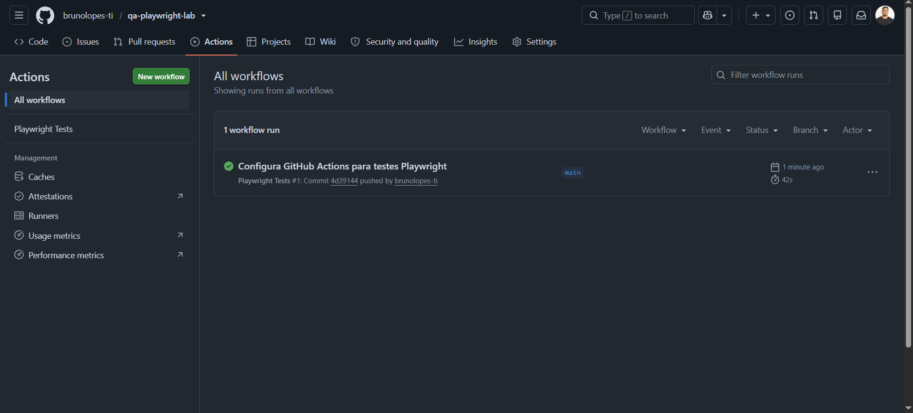

---

## Page Object Model

O projeto foi refatorado utilizando o padrão **Page Object Model (POM)**, separando a lógica das páginas da lógica dos cenários de teste.

Essa abordagem melhora a organização, manutenção e reutilização do código, deixando os testes mais limpos e próximos de uma estrutura utilizada em projetos reais de automação.

### Classes criadas

```text
pages/LoginPage.js
pages/InventoryPage.js
pages/CartPage.js
pages/CheckoutPage.js
```

### Responsabilidades

**LoginPage**

- Acessar a aplicação;
- Preencher usuário;
- Preencher senha;
- Clicar no botão de login;
- Centralizar o fluxo de autenticação.

**InventoryPage**

- Validar elementos da página de produtos;
- Adicionar produto ao carrinho;
- Abrir o carrinho;
- Validar contador do carrinho.

**CartPage**

- Validar produto no carrinho;
- Validar preço;
- Validar botão de checkout;
- Avançar para o checkout.

**CheckoutPage**

- Preencher dados do comprador;
- Avançar para a tela de resumo;
- Validar produto, preço e subtotal;
- Finalizar a compra;
- Validar mensagem de pedido concluído.

---

## Arquivos de teste

### Login

Arquivo:

```text
tests/saucedemo-login.spec.js
```

Cenários cobertos:

- Login válido;
- Login inválido;
- Login com usuário bloqueado.

### Carrinho

Arquivo:

```text
tests/saucedemo-cart.spec.js
```

Cenários cobertos:

- Adicionar produto ao carrinho;
- Validar produto, preço e botão de checkout na página do carrinho.

### Checkout

Arquivo:

```text
tests/saucedemo-checkout.spec.js
```

Cenário coberto:

- Realizar checkout completo com sucesso.

---

## Cenários automatizados

### CT-01 - Login válido

**Objetivo:** validar que um usuário com credenciais corretas consegue acessar a página de produtos.

**Dados utilizados:**

| Campo | Valor |
|---|---|
| Usuário | `standard_user` |
| Senha | `secret_sauce` |

**Validações realizadas:**

- Redirecionamento para `/inventory.html`;
- Exibição do título `Products`;
- Exibição da lista de produtos.

**Evidências:**

```text
docs/evidencias/playwright/login-valido-teste-passando.png
docs/evidencias/playwright/login-valido-saucedemo.png
```

---

### CT-02 - Login inválido

**Objetivo:** validar que o sistema exibe mensagem de erro ao tentar login com credenciais inválidas.

**Dados utilizados:**

| Campo | Valor |
|---|---|
| Usuário | `usuario_invalido` |
| Senha | `senha_invalida` |

**Validações realizadas:**

- Exibição da mensagem de erro;
- Permanência do usuário na tela de login.

**Evidências:**

```text
docs/evidencias/playwright/login-invalido-teste-passando.png
docs/evidencias/playwright/login-invalido-saucedemo.png
```

---

### CT-03 - Login com usuário bloqueado

**Objetivo:** validar que o sistema bloqueia o acesso de um usuário impedido de realizar login.

**Dados utilizados:**

| Campo | Valor |
|---|---|
| Usuário | `locked_out_user` |
| Senha | `secret_sauce` |

**Validações realizadas:**

- Exibição da mensagem de usuário bloqueado;
- Permanência do usuário na tela de login.

**Evidências:**

```text
docs/evidencias/playwright/login-usuario-bloqueado-teste-passando.png
docs/evidencias/playwright/login-usuario-bloqueado-saucedemo.png
```

---

### CT-04 - Adicionar produto ao carrinho

**Objetivo:** validar que um produto pode ser adicionado ao carrinho com sucesso.

**Produto utilizado:**

| Produto | Valor |
|---|---|
| Sauce Labs Backpack | `$29.99` |

**Validações realizadas:**

- Clique no botão `Add to cart`;
- Exibição do contador do carrinho com valor `1`;
- Alteração do botão para `Remove`.

**Evidências:**

```text
docs/evidencias/playwright/produto-adicionado-carrinho-teste-passando.png
docs/evidencias/playwright/produto-adicionado-carrinho-saucedemo.png
```

---

### CT-05 - Validar produto na página do carrinho

**Objetivo:** validar que o produto adicionado aparece corretamente na página do carrinho.

**Validações realizadas:**

- Redirecionamento para `/cart.html`;
- Exibição do título `Your Cart`;
- Exibição do produto `Sauce Labs Backpack`;
- Exibição do preço `$29.99`;
- Exibição do botão `Checkout`.

**Evidências:**

```text
docs/evidencias/playwright/validacao-carrinho-teste-passando.png
docs/evidencias/playwright/validacao-carrinho-saucedemo.png
```

---

### CT-06 - Checkout completo

**Objetivo:** validar o fluxo completo de compra, desde o carrinho até a finalização do pedido.

**Dados utilizados:**

| Campo | Valor |
|---|---|
| Nome | `Bruno` |
| Sobrenome | `Ramos` |
| CEP | `72000-000` |

**Validações realizadas:**

- Acesso à etapa de informações do checkout;
- Preenchimento dos dados do comprador;
- Acesso à tela de resumo da compra;
- Validação do produto no resumo;
- Validação do preço;
- Finalização da compra;
- Exibição da mensagem `Thank you for your order!`.

**Evidências:**

```text
docs/evidencias/playwright/checkout-completo-teste-passando.png
docs/evidencias/playwright/checkout-completo-saucedemo.png
```

---

## Resultado da suíte completa

A suíte foi executada via terminal com:

```bash
npx playwright test --headed
```

Resultado:

```text
saucedemo-login.spec.js       3 testes passando
saucedemo-cart.spec.js        2 testes passando
saucedemo-checkout.spec.js    1 teste passando

Total: 6 testes passando
```

### Evidência da suíte completa

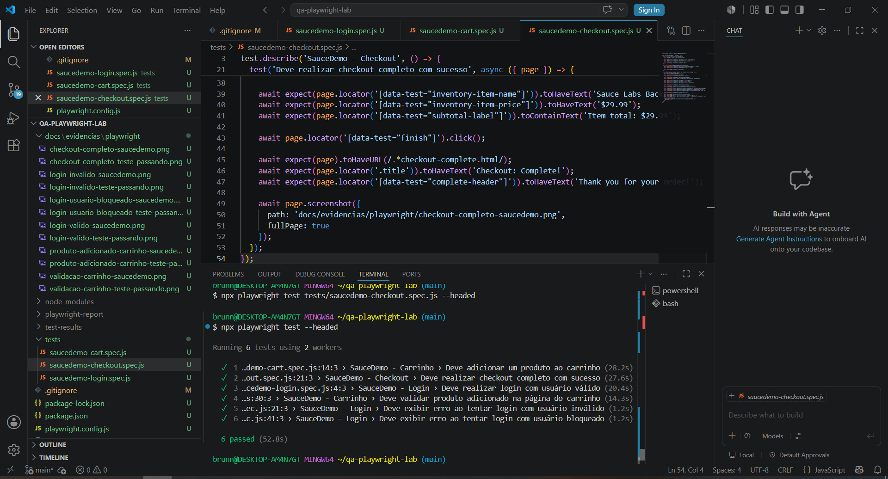

### Evidência após aplicação do Page Object Model

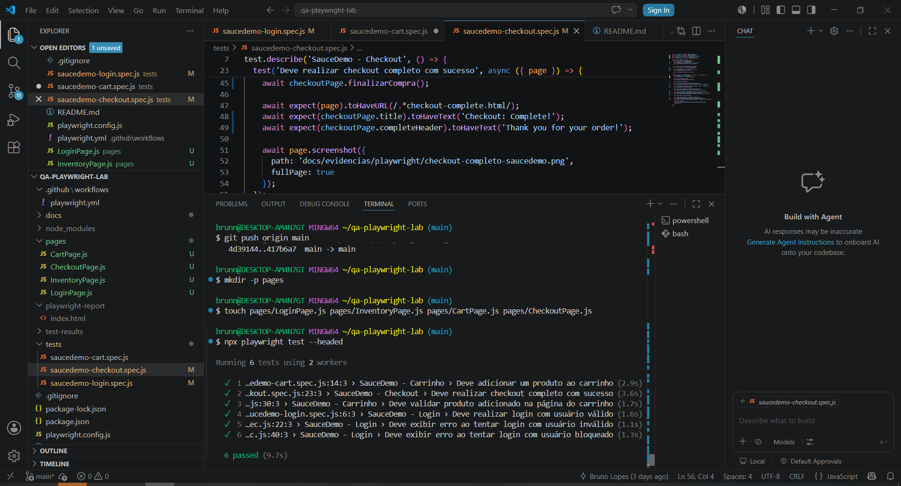

---

## Evidências visuais

### Login válido

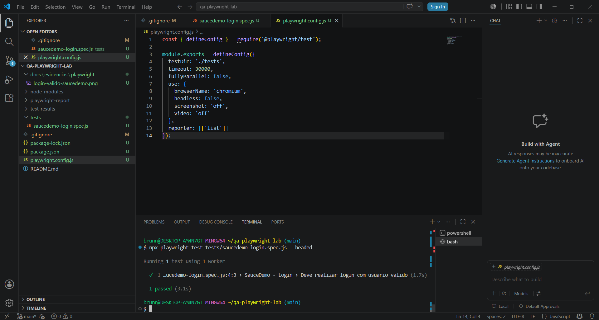

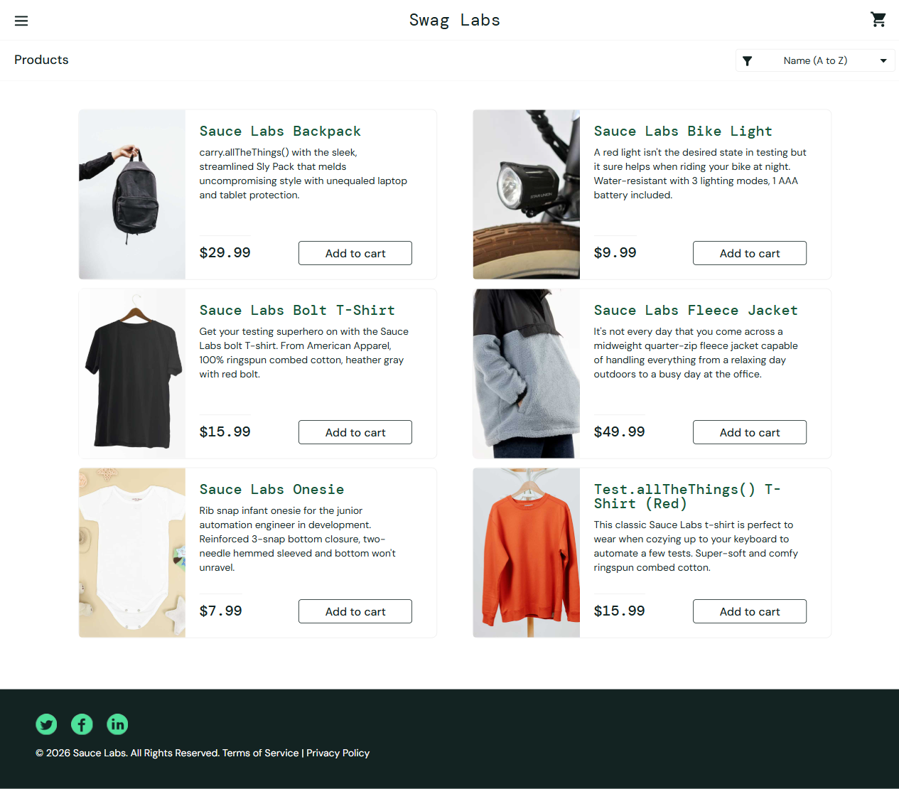

### Login inválido

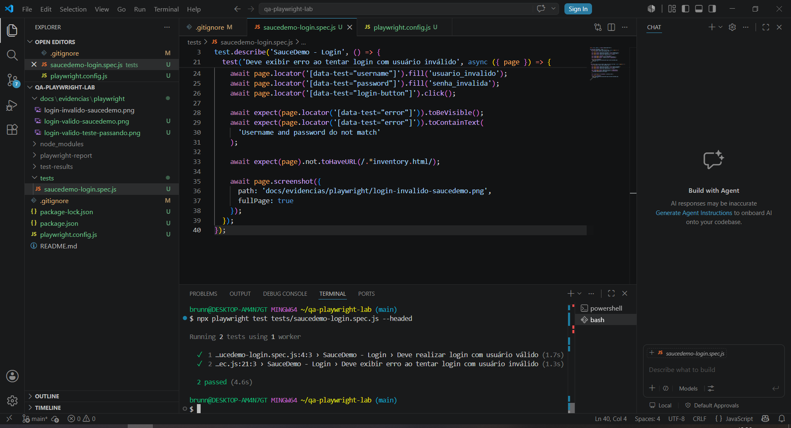

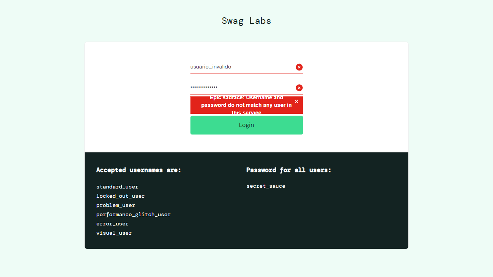

### Usuário bloqueado

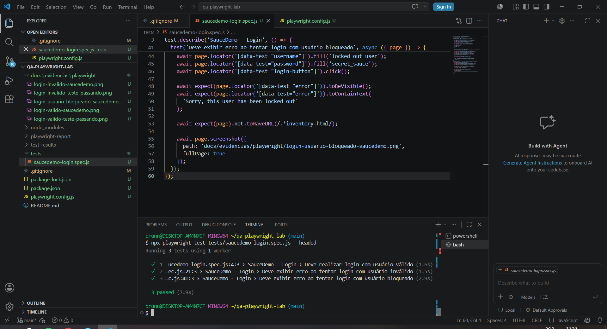

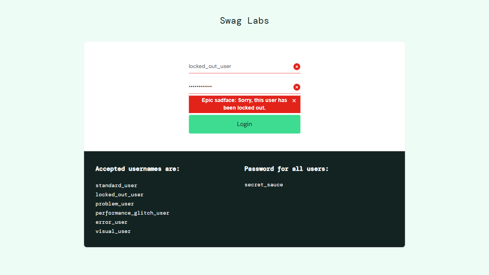

### Carrinho

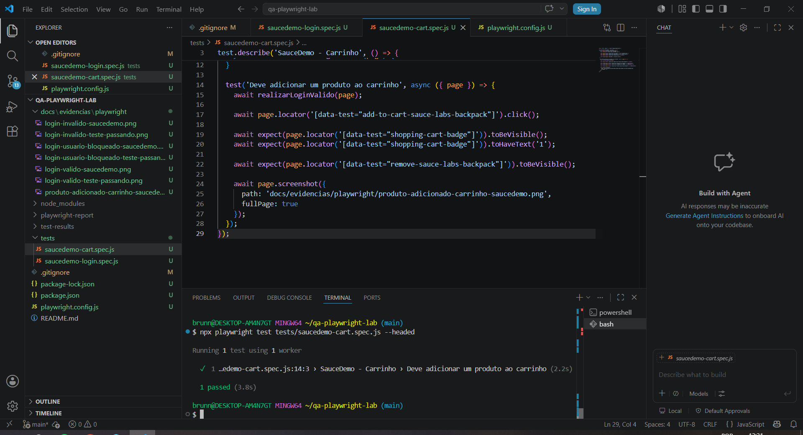

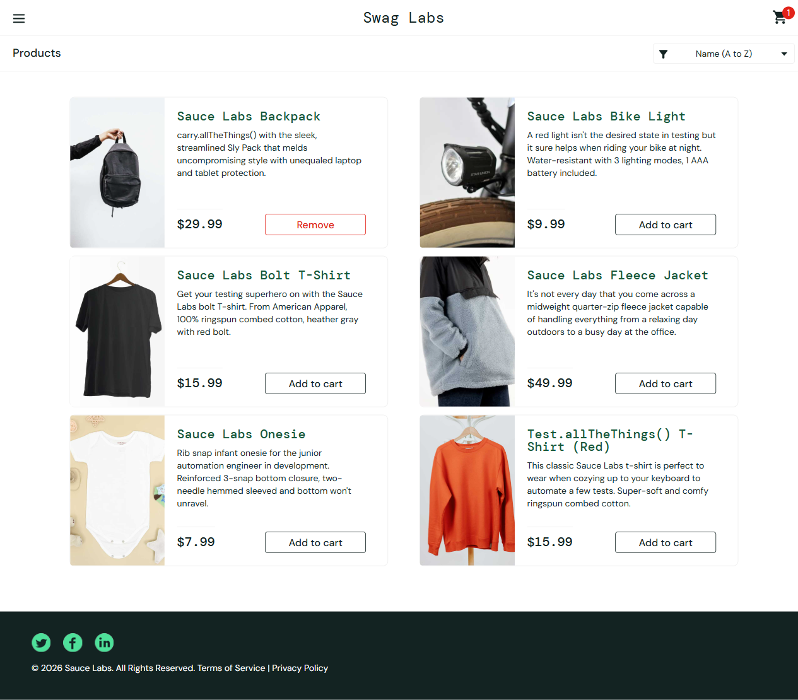

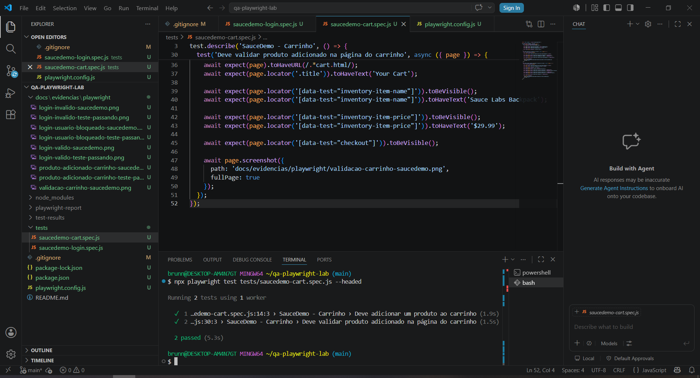

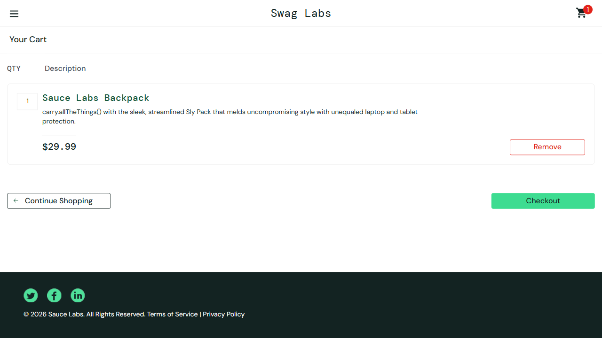

### Checkout

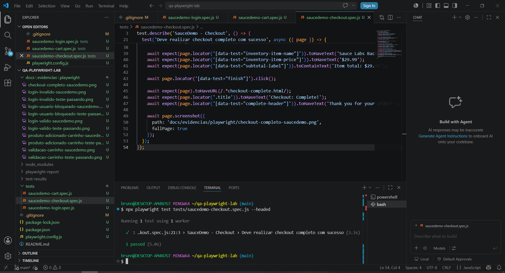

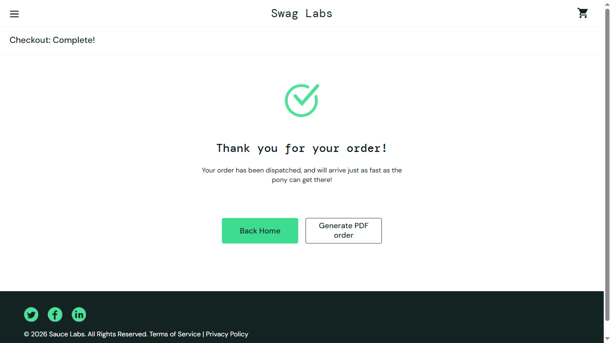

---

## Configuração do Playwright

Arquivo:

```text
playwright.config.js
```

Configuração utilizada:

```javascript
const { defineConfig } = require('@playwright/test');

module.exports = defineConfig({
  testDir: './tests',
  timeout: 30000,
  fullyParallel: false,
  retries: process.env.CI ? 1 : 0,
  workers: process.env.CI ? 1 : undefined,

  use: {
    browserName: 'chromium',
    headless: process.env.CI ? true : false,
    screenshot: 'off',
    video: 'off'
  },

  reporter: process.env.CI ? [['html'], ['list']] : [['list']]
});
```

Em ambientes de CI, a variável `CI` é utilizada para executar o Chromium em modo **headless**, limitar a execução a um worker, habilitar retry e gerar o relatório HTML do Playwright.

---

## GitHub Actions

Arquivo:

```text
.github/workflows/playwright.yml
```

Workflow configurado:

```yaml
name: Playwright Tests

on:
  push:
    branches: [ main ]

  pull_request:
    branches: [ main ]

jobs:
  test:
    name: Run Playwright Tests
    runs-on: ubuntu-latest
    timeout-minutes: 60

    steps:
      - name: Checkout repository
        uses: actions/checkout@v5

      - name: Setup Node.js
        uses: actions/setup-node@v5
        with:
          node-version: lts/*

      - name: Install dependencies
        run: npm ci

      - name: Install Playwright browsers
        run: npx playwright install --with-deps chromium

      - name: Run Playwright tests
        run: npx playwright test

      - name: Upload Playwright report
        if: ${{ !cancelled() }}
        uses: actions/upload-artifact@v4
        with:
          name: playwright-report
          path: playwright-report/
          retention-days: 30
```

---

## Azure DevOps

O projeto também foi integrado ao **Azure DevOps**, utilizando **Azure Pipelines** para execução automatizada da suíte Playwright e **Azure Boards** para organização e rastreabilidade das atividades relacionadas à implementação.

A integração mantém o código-fonte no GitHub e utiliza o Azure DevOps como plataforma complementar de CI e gerenciamento do trabalho.

---

## Azure Pipelines

O pipeline do Azure DevOps é definido por YAML no arquivo:

```text
azure-pipelines.yml
```

A execução é acionada automaticamente após alterações na branch `main`.

### Fluxo de execução

```text
Push na branch main
        ↓
GitHub
        ↓
Azure Pipelines
        ↓
Checkout do repositório
        ↓
Configuração do Node.js
        ↓
npm ci
        ↓
Instalação do Chromium
        ↓
Playwright em modo headless
        ↓
6 testes executados
        ↓
Relatório HTML
        ↓
Pipeline Artifact
```

### Etapas configuradas

- Checkout do repositório GitHub;
- Configuração do Node.js;
- Instalação das dependências com `npm ci`;
- Instalação do Chromium e dependências necessárias;
- Execução dos testes Playwright;
- Uso da variável de ambiente `CI`;
- Execução do Chromium em modo headless;
- Geração do relatório HTML;
- Publicação da pasta `playwright-report` como Pipeline Artifact.

### Configuração do pipeline

```yaml
trigger:
  - main

pr:
  - main

pool:
  vmImage: 'ubuntu-latest'

steps:
  - checkout: self

  - task: UseNode@1
    inputs:
      version: '20.x'
    displayName: 'Instalar Node.js'

  - script: npm ci
    displayName: 'Instalar dependências'

  - script: npx playwright install --with-deps chromium
    displayName: 'Instalar Chromium'

  - script: npx playwright test
    displayName: 'Executar testes Playwright'
    env:
      CI: 'true'

  - task: PublishPipelineArtifact@1
    condition: always()
    inputs:
      targetPath: 'playwright-report'
      artifact: 'playwright-report'
      publishLocation: 'pipeline'
    displayName: 'Publicar relatório Playwright'
```

### Resultado da execução no Azure Pipelines

Na execução documentada:

```text
6 testes executados
6 testes aprovados
0 falhas
0 flaky
0 ignorados
```

Tempo registrado no relatório:

```text
6.6 segundos
```

A execução completa do pipeline foi concluída com sucesso, incluindo preparação do ambiente, execução da suíte e publicação do artifact.

### Evidência do pipeline configurado

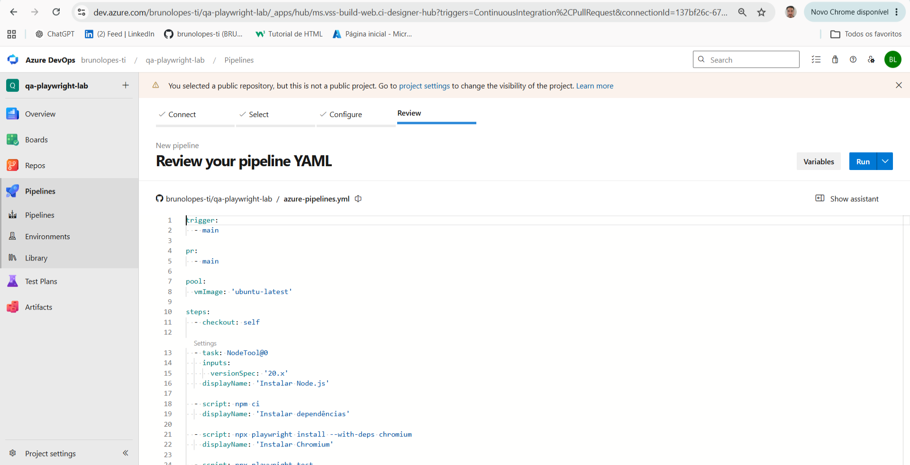

### Evidência do pipeline concluído com sucesso

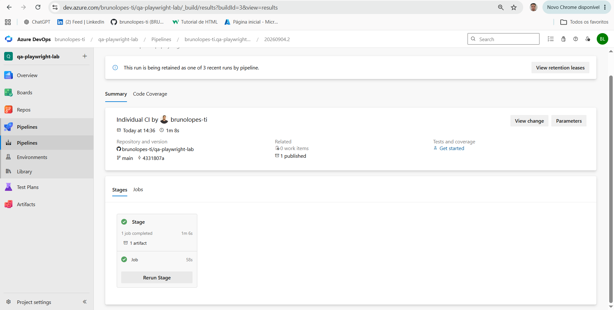

### Evidência da execução dos testes

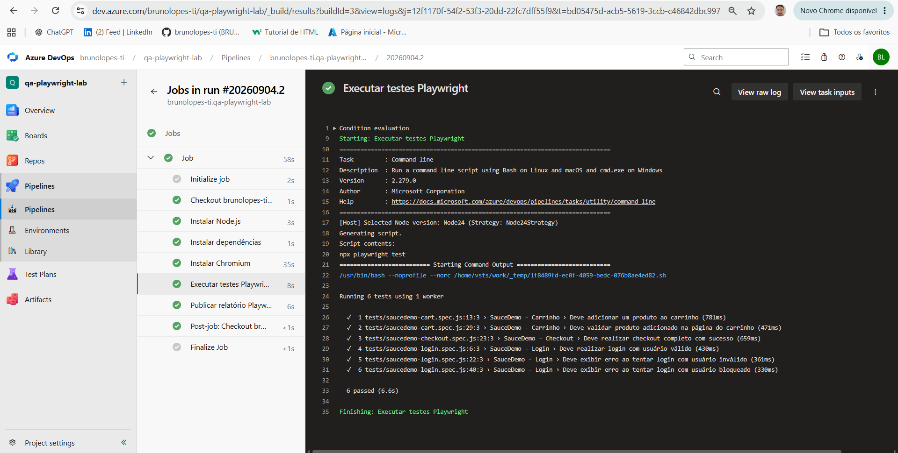

---

## Pipeline Artifact

Após a execução da suíte, o Playwright gera um relatório HTML.

A pasta:

```text
playwright-report
```

é publicada automaticamente no Azure DevOps utilizando:

```yaml
PublishPipelineArtifact@1
```

O artifact permite recuperar o relatório gerado após o término da execução do pipeline.

### Evidência da publicação

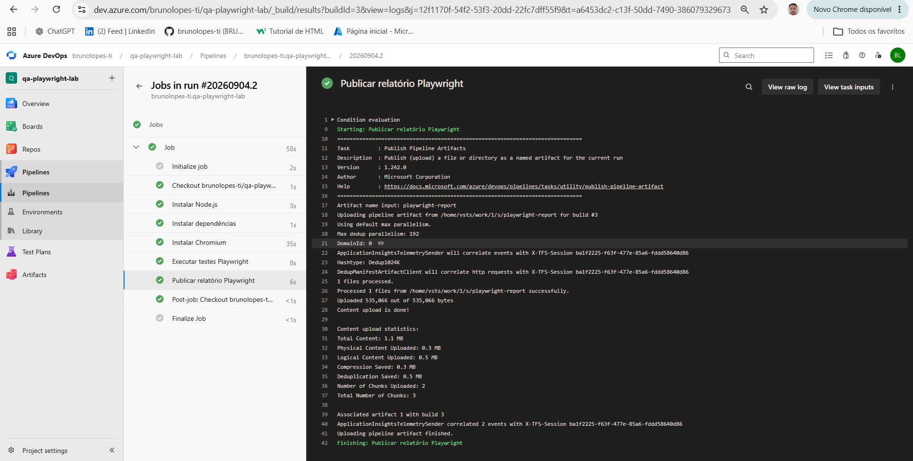

### Evidência do artifact disponível

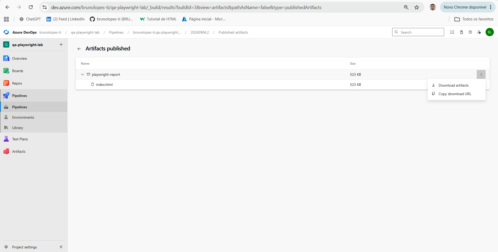

---

## Relatório HTML no Azure Pipelines

O relatório HTML do Playwright foi recuperado a partir do artifact publicado pelo Azure Pipelines.

Resultado registrado:

```text
All:     6
Passed:  6
Failed:  0
Flaky:   0
Skipped: 0
```

Os cenários exibidos no relatório correspondem aos fluxos de:

- Login;
- Carrinho;
- Checkout.

### Evidência

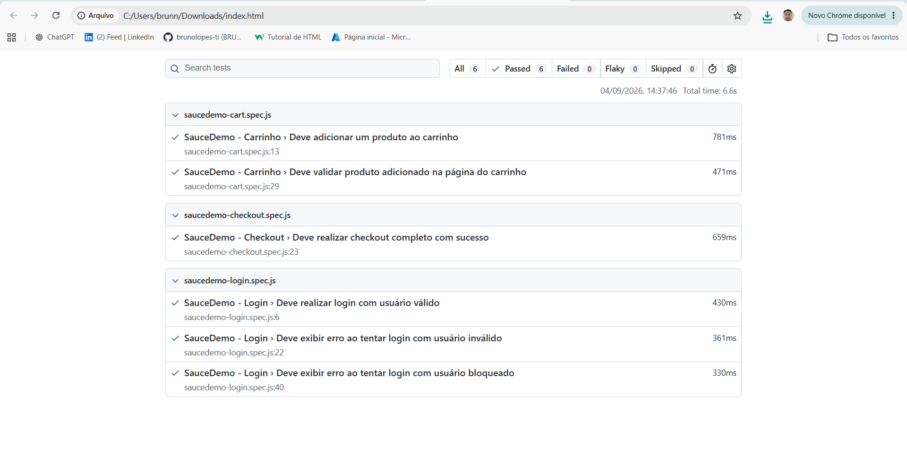

---

## Azure Boards

O **Azure Boards** foi utilizado para organizar e acompanhar as atividades necessárias para implementar a integração do projeto com Azure DevOps.

O projeto utiliza o processo **Basic**, com organização baseada em:

```text
Issue
└── Task
```

Foi criado o seguinte Issue:

```text
Issue #1
Integrar testes Playwright ao Azure DevOps
```

### Critérios de conclusão definidos

- Pipeline configurado por YAML;
- Execução automática após push na `main`;
- Suíte Playwright executada com sucesso;
- 6 testes aprovados;
- Relatório HTML publicado como artifact;
- Evidências registradas no projeto.

### Tasks relacionadas

Foram criadas quatro Tasks filhas:

1. Configurar Azure Pipeline para execução dos testes Playwright;
2. Executar suíte Playwright em CI;
3. Publicar relatório HTML como artifact;
4. Validar execução e registrar evidências.

As quatro Tasks foram relacionadas ao Issue principal utilizando relação **Parent/Child**.

Ao final da implementação:

```text
Issue #1 — Done
├── Task #2 — Done
├── Task #3 — Done
├── Task #4 — Done
└── Task #5 — Done
```

### Tags utilizadas

```text
Azure-DevOps
CI/CD
Playwright
QA
```

### Evidência do Board

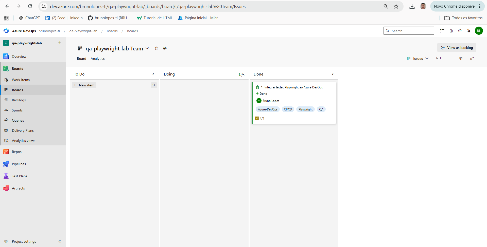

### Evidência de rastreabilidade

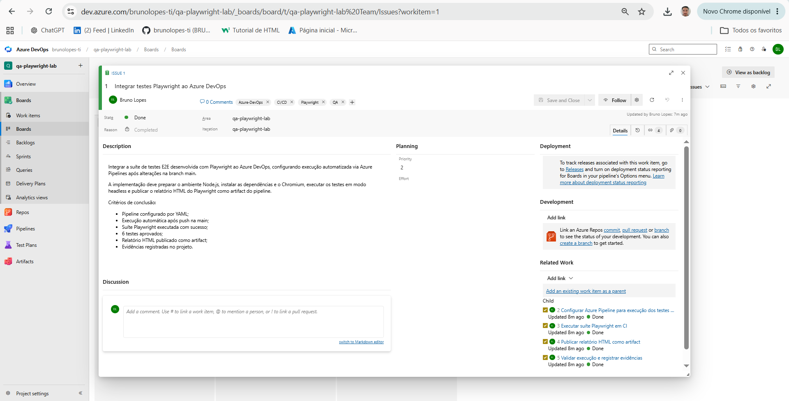

---

## Boas práticas aplicadas

- Separação dos testes por fluxo funcional;
- Uso de seletores estáveis com `data-test`;
- Validações de URL, textos, elementos visíveis e fluxo de navegação;
- Uso de `async/await`;
- Assertions nativas do Playwright com `expect`;
- Aplicação do Page Object Model;
- Separação entre lógica de página e cenários de teste;
- Criação de classes reutilizáveis;
- Organização de evidências em pasta específica;
- Execução da suíte completa via terminal;
- Execução automatizada com GitHub Actions;
- Execução automatizada com Azure Pipelines;
- Configuração de pipeline por YAML;
- Execução de testes em ambiente CI;
- Execução do navegador em modo headless;
- Geração de relatório HTML;
- Publicação de Pipeline Artifact;
- Organização de trabalho com Azure Boards;
- Uso de Issue e Tasks;
- Rastreabilidade Parent/Child;
- Uso de critérios de conclusão;
- Controle de arquivos temporários com `.gitignore`;
- Versionamento com Git e GitHub.

---

## Competências demonstradas

Este projeto demonstra conhecimentos práticos em:

- Automação de testes Web;
- Testes end-to-end;
- Playwright;
- JavaScript;
- Node.js;
- Page Object Model;
- Assertions;
- Seletores;
- Testes positivos e negativos;
- Automação de login, carrinho e checkout;
- GitHub Actions;
- Azure DevOps;
- Azure Pipelines;
- Azure Boards;
- CI/CD;
- Pipeline as Code com YAML;
- Execução headless;
- Pipeline Artifact;
- Organização e rastreabilidade de atividades;
- Git e GitHub;
- Evidências de execução;
- Documentação técnica.

---

## Resultado técnico

O projeto atualmente possui:

```text
6 testes E2E automatizados
6 testes aprovados
3 arquivos de especificação
4 Page Objects
2 integrações de CI
1 pipeline GitHub Actions
1 pipeline Azure Pipelines
1 relatório HTML publicado como artifact
1 Issue documentado no Azure Boards
4 Tasks relacionadas e concluídas
```

A suíte cobre autenticação, carrinho e checkout e pode ser executada localmente ou automaticamente por pipelines de integração contínua.

---

## Status do projeto

**Concluído nesta etapa.**

Suíte automatizada Playwright criada, organizada, executada e documentada, utilizando **Page Object Model**, integrada a **GitHub Actions** e **Azure Pipelines**, com publicação de relatório HTML como artifact e organização/rastreabilidade das atividades através do **Azure Boards**.

O projeto possui evidências públicas da automação, da execução em CI e da implementação realizada.

---

## Próximas melhorias possíveis

- Utilizar massa de dados externa;
- Criar comandos e funções auxiliares reutilizáveis;
- Adicionar novos cenários negativos no checkout;
- Expandir a execução para múltiplos navegadores;
- Implementar testes parametrizados;
- Explorar execução paralela em diferentes navegadores;
- Evoluir políticas de execução em Pull Requests;
- Explorar integração entre commits, pipelines e Work Items;
- Adicionar novos relatórios e métricas de execução.

---

## Autor

**Bruno Ramos Lopes**

LinkedIn: [linkedin.com/in/brunolopes-ti](https://linkedin.com/in/brunolopes-ti)  
GitHub: [github.com/brunolopes-ti](https://github.com/brunolopes-ti)